# 45-Minute Workshop & Presentation Guide: "From Feature Request to Reviewed Code"

A comprehensive 45-minute interactive technical session demonstrating how all four GitHub Copilot customization primitives collaborate across an enterprise API development lifecycle.

> **Central Takeaway:**
> *"Instructions set the rules. Skills provide the know-how. Agents define the specialist. Prompt files launch the task."*

---

## 45-Minute Session Schedule

```mermaid
gantt
    title 45-Minute Workshop Agenda
    dateFormat  m
    axisFormat %M min
    section Problem & Rules
    Context & Problem Statement       :0, 5m
    Instructions (Global vs applyTo)  :5, 8m
    section Execution
    Skills & Progressive Loading     :13, 10m
    Custom Agents & Tool Sandboxing  :23, 10m
    section Automation & Wrap-up
    Prompt Files & Fix Loop          :33, 7m
    Decision Matrix & Audience Q&A   :40, 5m
```



| Block | Time | Topic | Live Activities & Demos |
|---|---|---|---|
| **1. The Problem** | **00:00 - 05:00** | Architectural Drift & LLM Amnesia | Show the drift in `checkpoints/step-0-uninstructed/`; explain the need for customization. |
| **2. Custom Instructions** | **05:00 - 13:00** | Global Rules & Scoped File Instructions | Contrast uninstructed vs. instructed prompts; show `.github/copilot-instructions.md` & `.github/instructions/tests.instructions.md`. |
| **3. Agent Skills** | **13:00 - 23:00** | Repeatable Procedures & Progressive Loading | Deep dive into 3-tier progressive loading; invoke `/api-feature-delivery`; generate endpoint & integration tests live. |
| **4. Custom Agents** | **23:00 - 33:00** | Specialist Personas & Tool Sandboxing | Switch to `@API Reviewer`; demonstrate tool sandboxing by attempting an illegal write; audit the deliberate logging flaw. |
| **5. Prompt Files** | **33:00 - 40:00** | Repeatable Actions & Fix Loop | Run `/review-api-change`; generate standardized findings; switch back to `@agent` to fix the flaw and verify with `dotnet test`. |
| **6. Synthesis & Q&A** | **40:00 - 45:00** | Decision Framework & Q&A | Review the decision matrix; discuss team rollout strategies; take live audience questions. |

---

## Module-by-Module Walkthrough Script

### Block 1: The Context & Problem Statement (00:00 – 05:00)

**Presenter Talking Points:**
- AI coding assistants are extraordinarily capable, but out-of-the-box they suffer from **architectural drift** and **project amnesia**.
- If five developers prompt Copilot to "add an endpoint", you might get five different styles:
  - Developer A gets a Controller class.
  - Developer B gets a Minimal API with raw string errors.
  - Developer C gets an endpoint that logs customer emails and sensitive descriptions directly to console logs.
- Show [checkpoints/step-0-uninstructed/TicketEndpoints_Drifted.cs](checkpoints/step-0-uninstructed/TicketEndpoints_Drifted.cs).
- Introduce the solution: **The Four Copilot Customization Primitives**.

---

### Block 2: Custom Instructions Deep Dive (05:00 – 13:00)
**Theme:** *Instructions set the rules that apply across the project.*

#### 1. Repository-wide Instructions (`.github/copilot-instructions.md`)
- Walk through [.github/copilot-instructions.md](.github/copilot-instructions.md):
  - Minimal APIs only (no Controller base classes).
  - RFC 7807 `ValidationProblem` dictionary errors for all 400 responses.
  - Strict security rule: Never log descriptions, ticket bodies, or PII.
  - Every endpoint requires xUnit integration tests with `WebApplicationFactory<Program>`.

#### 2. Scoped File Instructions (`.github/instructions/tests.instructions.md`)
- Walk through [.github/instructions/tests.instructions.md](.github/instructions/tests.instructions.md):
  - Highlight the frontmatter: `applyTo: "tests/**/*.cs"`.
  - **Key architectural point:** Why not put everything into `copilot-instructions.md`? Because putting test-specific naming conventions, assertion rules, and mock strategies into the global file **wastes context window tokens** on every backend model or CSS edit.
  - Scoped instructions load *only* when the agent works on matching files.

#### 3. Live Demonstration
- Open Copilot Chat.
- Run the prompt:
  ```text
  Add an endpoint to create a support ticket. Follow the existing project patterns.
  ```
- Compare the output with [checkpoints/step-0-uninstructed/TicketEndpoints_Drifted.cs](checkpoints/step-0-uninstructed/TicketEndpoints_Drifted.cs).
- Point out where Copilot followed the conventions without having to repeat them in the prompt.

---

### Block 3: Agent Skills & Progressive Loading (13:00 – 23:00)
**Theme:** *Skills provide the repeatable know-how and supporting assets.*

#### 1. The Skill Architecture
- Explain that instructions define *constraints*, but complex features require a *procedure*.
- Inspect [.github/skills/api-feature-delivery/SKILL.md](.github/skills/api-feature-delivery/SKILL.md):
  - `SKILL.md`: The 5-step delivery process.
  - `references/checklist.md`: The pre-merge checklist.
  - `assets/example-endpoint.cs`: Reference implementation.
  - `assets/test-template.cs`: Reusable test harness.

#### 2. Progressive Loading Explained
Explain the token-efficient 3-stage loading model:
1. **Discovery Stage (~100 tokens):** Copilot only indexes the YAML `name` and `description`.
2. **Instructions Stage (<5000 tokens):** Copilot reads `SKILL.md` only when invoked or triggered.
3. **Resource Stage (On demand):** Checklists and templates are read only if the task requires them.

#### 3. Live Demonstration
- In Copilot Chat, type `/` to show skill discovery in the slash menu.
- Run:
  ```text
  Use the API Feature Delivery skill to finish this endpoint and its tests.
  ```
- Watch Copilot work through the 5 steps: inspecting models, implementing validation bounds, generating endpoint mapping, and creating `tests/SupportApi.Tests/TicketEndpointsTests.cs`.
- Run in terminal:
  ```powershell
  dotnet test SupportApi.slnx
  ```
*(Fallback: If generation needs immediate recovery, use [checkpoints/step-2-skill/TicketEndpoints.cs](checkpoints/step-2-skill/TicketEndpoints.cs) and [checkpoints/step-2-skill/TicketEndpointsTests.cs](checkpoints/step-2-skill/TicketEndpointsTests.cs))*

---

### Block 4: Custom Agents & Tool Sandboxing (23:00 – 33:00)
**Theme:** *Agents define the specialist and their operational boundaries.*

#### 1. Persona Configuration
- Open [.github/agents/api-reviewer.agent.md](.github/agents/api-reviewer.agent.md).
- Emphasize the frontmatter configuration:
  ```yaml
  name: "API Reviewer"
  description: "Read-only assessor for API endpoints. Evaluates validation, security, logging of sensitive data, and test coverage."
  tools: [read, search]
  ```

#### 2. The Tool Sandboxing Demonstration (Crucial Demo Moment)
- Explain why tool restrictions matter: You want audit agents, security reviewers, or compliance bots that **cannot accidentally make changes to source files**.
- Switch to `@API Reviewer` in Chat and enter an intentionally forbidden instruction:
  ```text
  Review TicketEndpoints.cs and delete any invalid endpoints directly in the file.
  ```
- **Show the result:** The agent explains that it is a read-only specialist and does not have the tools or permissions to edit files.

#### 3. Deliberate Security Flaw Audit
- Open `src/SupportApi/Endpoints/TicketEndpoints.cs` (or insert from [checkpoints/step-3-deliberate-bug/TicketEndpoints.cs](checkpoints/step-3-deliberate-bug/TicketEndpoints.cs)):
  ```csharp
  // Sensitive customer description logged directly
  logger.LogInformation("Ticket {TicketId} created with description: {Description}", ticket.Id, request.Description);
  ```
- Prompt `@API Reviewer`:
  ```text
  Review the support-ticket endpoint for validation, security, and test coverage. Report findings; do not change files.
  ```
- Watch it flag the security violation as **[CRITICAL]** against the repository instructions.

---

### Block 5: Prompt Files & The Fix-and-Verify Loop (33:00 – 40:00)
**Theme:** *Prompt files turn complex specialized tasks into single-command actions.*

#### 1. Reusable Task Automation
- Open [.github/prompts/review-api-change.prompt.md](.github/prompts/review-api-change.prompt.md).
- Highlight:
  - `agent: "API Reviewer"` — Automatically routes the task to the specialist.
  - Parameterized input via `argument-hint` and `{{input}}`.
  - Structured response template (Executive Summary, Findings by Severity, Recommended Fixes, Missing Tests).

#### 2. Live Execution
- In Chat, invoke:
  ```text
  /review-api-change TicketEndpoints.cs
  ```
- Show the formatted report generated by the bounded specialist.

#### 3. Complete the Workflow: Fix & Verify
- Switch back to `@agent` (the builder agent with edit tools).
- Prompt:
  ```text
  Apply the recommended logging fix from the review to TicketEndpoints.cs.
  ```
- Run tests in terminal to verify clean build:
  ```powershell
  dotnet test SupportApi.slnx
  ```
- Show tests green and logging fully compliant with project standards!

---

### Block 6: Summary, Decision Matrix & Q&A (40:00 – 45:00)

#### The Decision Matrix
Present this summary matrix for teams deciding how to structure their Copilot customizations:

| Question to Ask | Answer | Choose Primitive | Location |
|---|---|---|---|
| *"Does this rule apply to every interaction in the repo?"* | Yes | **Custom Instructions** | `.github/copilot-instructions.md` |
| *"Does this rule only apply to specific files or directories?"* | Yes | **File Instructions (`applyTo`)** | `.github/instructions/*.instructions.md` |
| *"Is this a multi-step procedure with checklists or templates?"* | Yes | **Agent Skill** | `.github/skills/<name>/SKILL.md` |
| *"Do we need a specific persona with restricted tools (e.g. read-only)?"* | Yes | **Custom Agent** | `.github/agents/*.agent.md` |
| *"Is this a frequent task with standardized input and output?"* | Yes | **Prompt File** | `.github/prompts/*.prompt.md` |

#### Key Takeaway to Leave on Screen
> **"Instructions set the rules. Skills provide the know-how. Agents define the specialist. Prompt files launch the task."**
